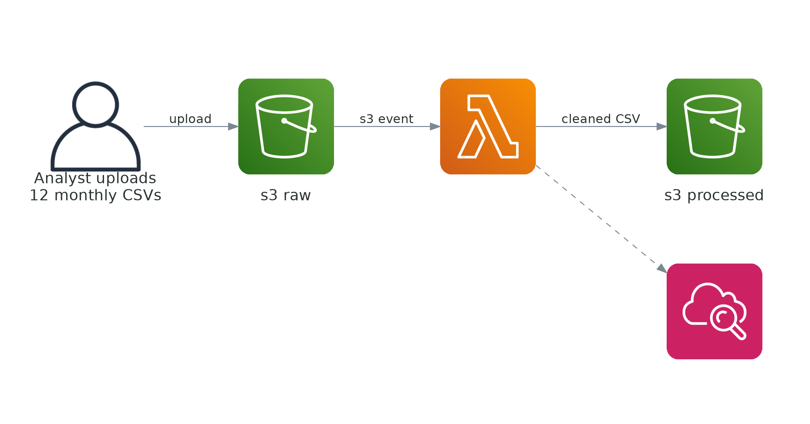
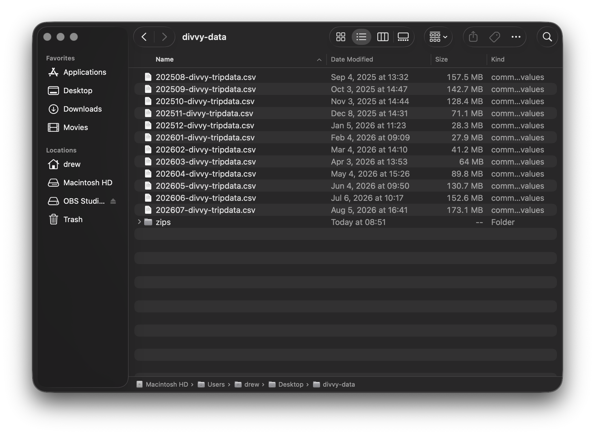
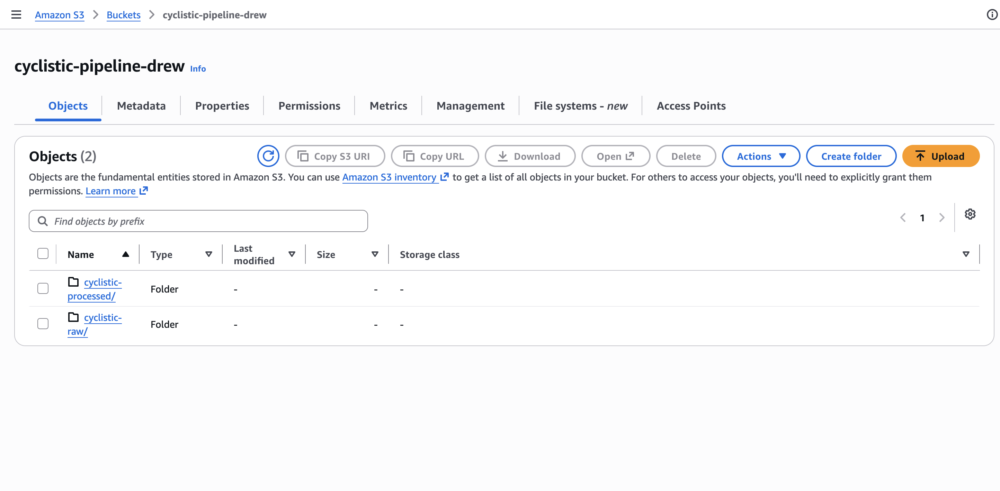
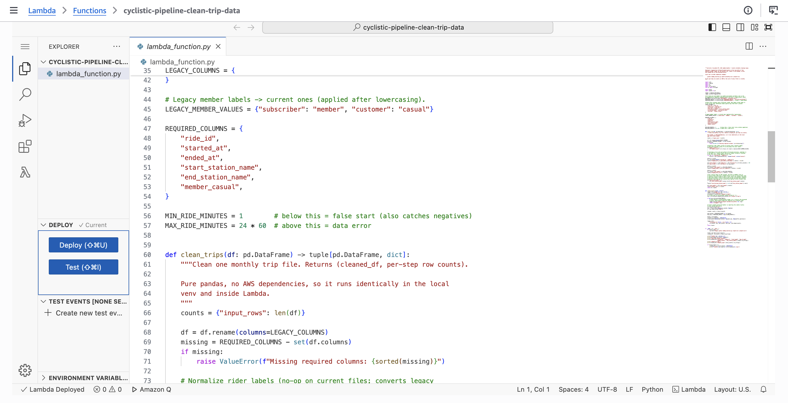
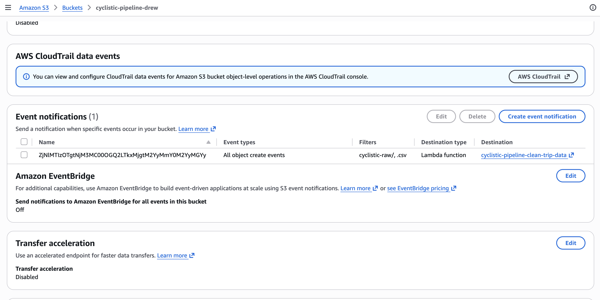
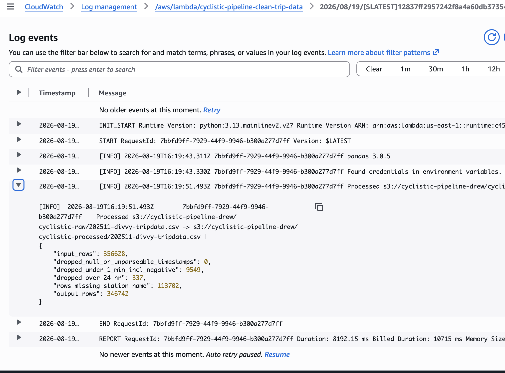

# Cyclistic Pipeline — Event-Driven ETL with AWS Lambda, S3, and pandas

A serverless cleaning pipeline for twelve months of real Chicago bike-share trip data. A CSV uploaded to the raw prefix of an S3 bucket fires an event notification that invokes a Python 3.13 Lambda; the function cleans the file with pandas and writes the result to the processed prefix of the same bucket. No schedulers, no servers — files land, code runs, outputs appear.



*The full pipeline: upload → S3 event → Lambda (pandas) → processed zone, with CloudWatch capturing every run.*

### Understanding the Services

- **Amazon S3** — cheap, durable object storage and the backbone of the pipeline. One bucket, two prefixes: `cyclistic-raw/` holds the untouched source files and `cyclistic-processed/` holds the cleaned output. Keeping the zones separate means the original data is never mutated — if the cleaning logic ever changes, the raw files are still there to re-run against.
- **AWS Lambda** — serverless compute that runs code in response to events. There is no server to patch, no scheduler to manage, and no charge while it sits idle. Each monthly file is cleaned by one invocation lasting seconds.
- **S3 Event Notifications** — the wiring that makes this event-driven. Any `.csv` landing under `cyclistic-raw/` automatically invokes the function. The prefix + suffix filter is also a safety guard: without it, the function's own output would re-trigger it in an infinite loop.
- **Amazon CloudWatch** — captures every invocation's logs and metrics. Each run logs a per-filter row-count accounting, so the cost of every cleaning rule is visible without any extra observability setup.

### Why Build It This Way

My earlier ETL projects were built by clicking through the AWS console and using managed Glue jobs. This project deliberately goes the other way: the entire environment is defined in one CloudFormation template and deployed from the command line.

1. **Reproducible:** anyone (including future me) can stand up the identical environment from `template.yaml` — no screenshots-of-console-settings archaeology.
2. **Reviewable:** the IAM permissions, the event filter, and the bucket policies are all readable in one file before anything is created.
3. **Disposable:** the whole stack tears down with one command, and a `DeletionPolicy: Retain` on the bucket makes sure teardown can't take the data with it.

Everything here can also be built through the AWS console UI — the template is simply the version you can prove, version-control, and re-create.

### The Data

Twelve months of real trip data (Aug 2025 – Jul 2026) published monthly by Divvy, Chicago's bike-share system — 6,037,968 rides in total, the public dataset behind the Google Data Analytics Capstone's fictional "Cyclistic" scenario.



*The twelve monthly source files, roughly 1.1 GB unzipped.*

### The Results

Full 12-month run: **6,037,968 rows in → 5,871,696 rows out (2.75% removed)**.

1. **160,931 rides under one minute dropped:** false starts, a filter that also catches any negative durations.
2. **5,341 rides over 24 hours dropped:** data errors.
3. **0 null or unparseable timestamps:** the defensive branch exists in the code but never fired on this data window.
4. **1,902,330 rows with missing station names retained, not dropped:** 32.4% of the output. In the months checked, nearly all of these are dockless e-bike rides — dropping them would gut any downstream bike-type analysis, so they're flagged with a `has_station_names` column and filtered at query time instead.

Cloud row counts matched the local test run exactly on all twelve months.

### What's in This Repo

- **`lambda_function.py`** — the Lambda handler. The cleaning logic lives in a pure `clean_trips()` function with no AWS dependencies, so the same code runs identically on a laptop and inside Lambda, returning per-filter row counts either way.
- **`template.yaml`** — **the deployable source of truth.** CloudFormation for the bucket (both prefixes, public access blocked, AES256 encryption), the least-privilege IAM role, the Lambda function, the S3→Lambda notification, and an explicit log group with capped retention.
- **`requirements.txt`** — dependencies for running the cleaning logic locally.
- **`iam_policy.json`** — a redacted export of the deployed role policy. **Documentation, not deployable input** — the account ID is replaced with `<ACCOUNT_ID>`. The role itself is created by `template.yaml`; this file exists so the permission boundaries can be read without parsing CloudFormation.
- **`s3_event_config.json`** — a redacted export of the bucket notification configuration. Same status: documentation only. The notification is created by `template.yaml`.
- **`screenshots/`** — the console captures embedded here and in the write-up.

### Prerequisites

- An AWS account and AWS CLI v2 configured with credentials that can create IAM roles, Lambda functions, S3 buckets, and log groups.
- Region **us-east-1** — or edit the `PandasLayerArn` parameter, because the pinned default (`AWSSDKPandas-Python313:16`, x86_64) is a us-east-1 ARN. AWS publishes per-region ARNs, resolvable via SSM public parameters.
- Python 3.13 locally if you want to run the cleaning logic before deploying (recommended): `pip install -r requirements.txt` in a venv.
- Divvy monthly trip data CSVs (public dataset).

### How to Deploy — Two Steps, Both Required

CloudFormation inline code caps out at 4,096 characters and always lands in `index.py`, which wouldn't match this module's handler path. So the template creates the function with **placeholder code**, and the real handler is installed in a second step. The function does not work until Step 2 runs.

- **Step 1: Create the stack.** `BucketName` must be overridden — S3 bucket names are globally unique, so the default (this project's bucket) will be rejected for anyone else. `CAPABILITY_IAM` is required because the template creates an IAM role, and that role is deliberately narrow: `s3:GetObject` on the raw prefix only, `s3:PutObject` on the processed prefix only, logs scoped to this one function's log group.

```bash
aws cloudformation create-stack \
  --stack-name cyclistic-pipeline \
  --template-body file://template.yaml \
  --parameters ParameterKey=BucketName,ParameterValue=<your-unique-bucket-name> \
  --capabilities CAPABILITY_IAM

aws cloudformation wait stack-create-complete --stack-name cyclistic-pipeline
```



*The bucket after stack creation: raw and processed zones side by side.*

- **Step 2: Install the real handler.** The function name follows the pattern `<stack-name>-clean-trip-data`.

```bash
zip function.zip lambda_function.py

aws lambda update-function-code \
  --function-name cyclistic-pipeline-clean-trip-data \
  --zip-file fileb://function.zip
```



*The deployed handler in the Lambda console.*

- **Step 3: Run it.** Upload any monthly CSV to the raw prefix and the pipeline does the rest.

```bash
aws s3 cp 202511-divvy-tripdata.csv s3://<your-unique-bucket-name>/cyclistic-raw/
```



*The event notification that fires the function — scoped to `cyclistic-raw/` + `.csv`, one of three independent guards against a self-triggering loop (the other two: split IAM statements and an in-code prefix check).*

### Test It Locally First

The handler's cleaning logic is importable and runnable with no AWS credentials:

```bash
python lambda_function.py 202511-divvy-tripdata.csv
```

It prints the same per-filter row-count JSON the deployed function logs, plus a preview of the derived columns. Every number in this README was produced locally this way first, then confirmed identical in the cloud run.

### Sample Log Output

Each invocation logs the pandas version and a per-filter accounting line. Real output from the November 2025 file (request IDs omitted):

```
[INFO] pandas 3.0.5
[INFO] Processed s3://cyclistic-pipeline-drew/cyclistic-raw/202511-divvy-tripdata.csv
       -> s3://cyclistic-pipeline-drew/cyclistic-processed/202511-divvy-tripdata.csv
       | {"input_rows": 356628, "dropped_null_or_unparseable_timestamps": 0,
          "dropped_under_1_min_incl_negative": 9549, "dropped_over_24_hr": 337,
          "rows_missing_station_name": 113702, "output_rows": 346742}
```



*A successful invocation in CloudWatch — the full counts JSON is logged on every run.*

Across the twelve backfill invocations, durations ranged from 3.6 s (141k rows) to 18.9 s (869k rows), with peak memory at 1,353 MB of the 3,008 MB allocated. A `Found credentials in environment variables` line in the logs is just boto3 picking up the execution role's temporary credentials — normal, nothing secret is exposed.

### What It Cost

Processing all six million rows cost effectively nothing: twelve Lambda invocations totaling under two minutes of compute, which sits comfortably inside Lambda's permanent free tier. The design choices keep it that way:

1. **Pay-per-invocation compute** — nothing runs (or bills) between uploads, unlike a provisioned cluster or a scheduled job that spins up whether or not new data arrived.
2. **Log retention capped at 14 days** via an explicit log group resource — unbounded CloudWatch retention is the silent cost in serverless setups.
3. **S3 as the only standing resource** — a few GB of storage, cents per month.

### Things Worth Knowing

1. **Memory is set to 3,008 MB — this account's quota ceiling.** A 5,120 MB request was rejected at stack creation. Actual peak use was 1,353 MB on the largest month, so there's comfortable headroom.
2. **The pandas layer is pinned by explicit version, not `$LATEST`.** A floating layer reference would let the pandas version silently change between the run that produced the published numbers and a later re-deploy.
3. **The bucket has `DeletionPolicy: Retain`.** Deleting the stack does not delete the data — the processed zone is the input to the follow-up analytics project.

---

*Business scenario adapted from the Google Data Analytics Capstone (Cyclistic case study). Part of the [data-portfolio](../) series.*
